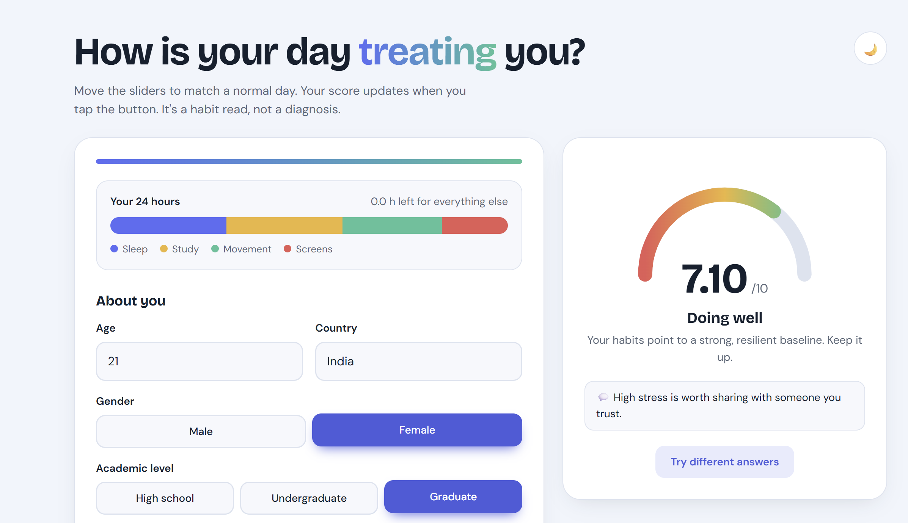
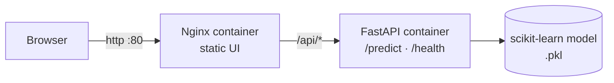
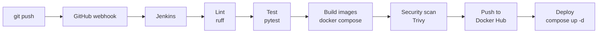
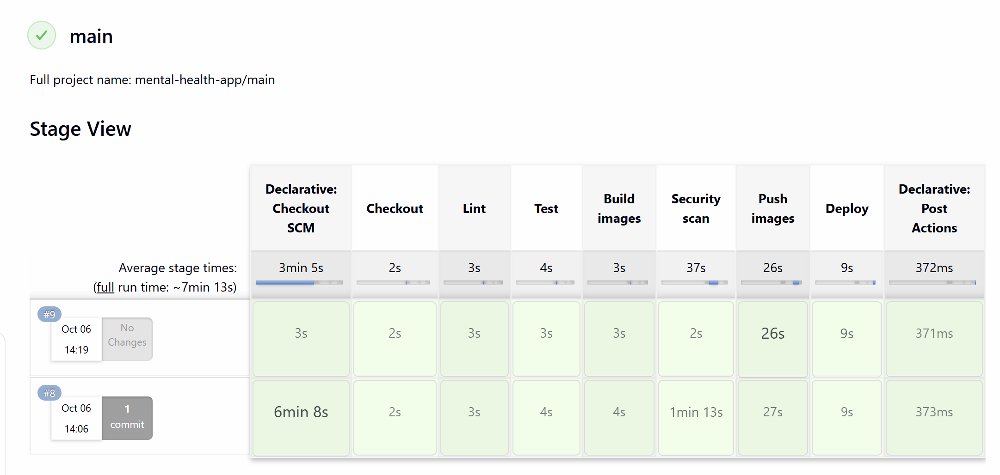

<div align="center">

# 🧠 Mental Health Signal

### An ML web app that estimates a student's mental health score from daily habits, built and shipped with a full CI/CD pipeline

<p>
  
  
  
  
</p>
<p>
  
  
  
  
</p>
<p>
  
  
  
  
</p>

<!-- Add a screenshot of the app: save it as docs/screenshot.png, then uncomment the line below -->
<!-  -->

</div>

---

## 📌 Overview

**Mental Health Signal** takes a few answers about a student's day (sleep, screen time, study hours, stress, and so on) and returns a predicted **mental health score from 0 to 10**.

The project has two sides:

- **The ML app.** A scikit-learn model trained on a student social-media dataset, served by a FastAPI backend and a responsive HTML/CSS/JS frontend.
- **The DevOps pipeline.** Every `git push` is linted, tested, built into Docker images, pushed to Docker Hub, and deployed automatically by Jenkins.

> ⚠️ This is an educational project, not a clinical tool. See the [disclaimer](#️-disclaimer).

---

## ✨ Features

**Application**
- 🎛️ Interactive form with sliders, tap-to-select options, and a live **24-hour day bar** that shows how your day is split
- 🎯 Animated score gauge with a short, personalised tip list
- 🌗 Light and dark themes
- ✅ Input validation on both the browser and the server (Pydantic)

**Engineering**
- 🐳 Backend and frontend each in their own Docker image, run together with Docker Compose
- 🔁 Jenkins pipeline: lint → test → build → push → deploy
- 🪝 GitHub webhook triggers builds automatically on every push
- 🧪 Automated API tests with pytest, linting with ruff
- ❤️ `/health` endpoint plus a Docker `HEALTHCHECK`, and a non-root container user

---

## 🏗️ Architecture



Nginx serves the UI and forwards everything under `/api/` to the backend, so the browser only talks to one origin and no hardcoded URLs are needed.

## 🔄 CI/CD Pipeline



| Stage | What happens |
|-------|--------------|
| **Checkout** | Jenkins pulls the latest commit |
| **Lint** | `ruff` checks the Python code |
| **Test** | `pytest` runs the API tests (valid prediction, bad input, health check) |
| **Build images** | `docker compose build` creates the backend and frontend images, tagged `latest` and with the build number |
| **Security scan** | Trivy scans both images for known HIGH and CRITICAL vulnerabilities |
| **Push images** | Images go to Docker Hub (`main` branch only) |
| **Deploy** | `docker compose up -d` starts the new version (`main` branch only) |



Docker Hub images: [`ruchitasingla/mh-backend`](https://hub.docker.com/r/ruchitasingla/mh-backend) and [`ruchitasingla/mh-frontend`](https://hub.docker.com/r/ruchitasingla/mh-frontend)
---
git add docs/pipeline.png README.md
## 🛠️ Tech Stack

| Area | Tools |
|------|-------|
| **Machine learning** | Python, Pandas, NumPy, Scikit-learn, Jupyter |
| **Backend** | FastAPI, Pydantic, Uvicorn |
| **Frontend** | HTML, CSS, JavaScript, served by Nginx |
| **Containers** | Docker, Docker Compose |
| **CI/CD** | Jenkins (Multibranch Pipeline), GitHub webhooks, ngrok |
| **Quality** | pytest, ruff |

---

## 📁 Project Structure

```
mental_health_recorder/
├── backend/
│   ├── main.py                 # FastAPI app: /predict, /health
│   ├── models/                 # Trained model (.pkl)
│   ├── tests/test_api.py       # API tests
│   ├── requirements.txt
│   ├── requirements-dev.txt    # pytest, httpx, ruff
│   └── Dockerfile
├── frontend/
│   ├── index.html
│   ├── style.css
│   ├── script.js
│   ├── nginx.conf              # serves UI, proxies /api to the backend
│   └── Dockerfile
├── jenkins/
│   └── Dockerfile              # Jenkins image with Python + Docker CLI
├── Jenkinsfile                 # The pipeline definition
├── docker-compose.yml
├── mental health.ipynb         # EDA, preprocessing, model training
└── Student Social Media And Mental Health Impact.csv
```

---

## 🚀 Getting Started

### Run with Docker (recommended)

You only need [Docker Desktop](https://www.docker.com/products/docker-desktop/).

```bash
git clone https://github.com/ruchitasingla/mental_health_recorder.git
cd mental_health_recorder
docker compose up --build
```

Open **http://localhost** and fill in the form. Check the API with **http://localhost/api/health**, which should return `{"status":"ok"}`.

Stop everything with `docker compose down`.

### Run the backend without Docker

Use Python 3.11 so the saved model loads with the same scikit-learn version it was trained with.

```bash
cd backend
python -m venv venv
venv\Scripts\activate          # macOS/Linux: source venv/bin/activate
pip install -r requirements-dev.txt
uvicorn main:app --reload
```

The interactive API docs are at http://localhost:8000/docs. To point the frontend at this server, add `<script>window.API_BASE="http://localhost:8000"</script>` above the `script.js` tag in `index.html`.

### Run the tests

```bash
cd backend
pytest -v
ruff check main.py tests
```

---

## 🔌 API

| Method | Endpoint | Description |
|--------|----------|-------------|
| `GET` | `/health` | Liveness check |
| `POST` | `/predict` | Returns the predicted score |

**Example request**

```json
{
  "age": 21,
  "gender": "Female",
  "country": "India",
  "academic_level": "Undergraduate",
  "most_used_platform": "Youtube",
  "purpose_of_use": "Education",
  "avg_daily_usage_hours": 4.5,
  "daily_unlocks": 80,
  "study_hours": 4,
  "physical_activity_hours": 1,
  "sleep_hours_per_night": 7,
  "stress_level": "Medium"
}
```

**Example response**

```json
{ "predicted_mental_health_score": 6.8 }
```

Invalid input (age out of range, unknown option, missing field) returns `422` with the failing field named.

---

## 🤖 Model

- **Dataset:** *Student Social Media and Mental Health Impact* (5,000 rows, 12 input features, one target score)
- **Steps:** cleaning, categorical encoding, grouping rare countries into `Other`, training and evaluation in [`mental health.ipynb`](mental%20health.ipynb)
- **Serving:** the trained pipeline is saved with `joblib` and loaded once when the API starts

| Metric | Score |
|--------|-------|
| R² | _add from notebook_ |
| MAE | _add from notebook_ |
| RMSE | _add from notebook_ |

---

## 🗺️ Roadmap

- [x] Dockerise backend and frontend
- [x] Jenkins pipeline with lint, test, build, push, deploy
- [x] Automatic builds on push (GitHub webhook)
- [ ] Image vulnerability scanning with Trivy
- [ ] Deploy to a cloud VM over SSH
- [ ] Monitoring with Prometheus and Grafana
- [ ] Infrastructure as code (Terraform, Ansible) and Kubernetes
- [ ] MLOps: experiment tracking and model drift checks

---

## ⚠️ Disclaimer

This project is for **educational purposes only**. Predictions come from a statistical model trained on a public dataset and are **not a medical diagnosis**. If you are struggling with your mental health, please reach out to a qualified professional or someone you trust.

---

## 👩‍💻 Author

**Ruchita Singla**

<a href="https://www.linkedin.com/in/ruchita-singla/">
  
</a>
<a href="https://github.com/ruchitasingla">
  
</a>
<a href="mailto:ruchitasingla001@gmail.com">
  
</a>

<div align="center">

⭐ If you found this project helpful, consider giving it a star!

</div>