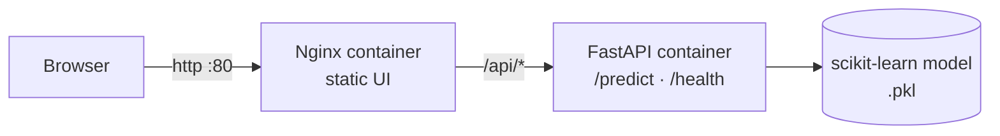
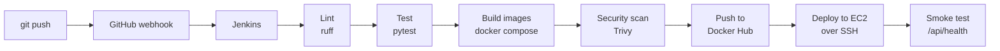
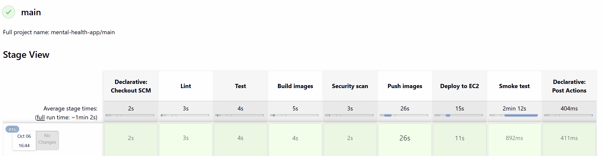

<div align="center">

# 🧠 Mental Health Signal

### An ML web app that estimates a student's mental health score from daily habits, shipped with a full CI/CD pipeline on AWS

<p>
  
  
  
  
</p>
<p>
  
  
  
  
</p>
<p>
  
  
  
  
</p>

<!-- After you add a screenshot of the app as docs/screenshot.png, uncomment the next line -->
<!--  -->

</div>

> **Live demo:** hosted on AWS EC2 and stopped when idle to save cost, so the link may be offline. See the demos and pipeline screenshot below, or run it locally with `docker compose up --build`.

<!-- Add your video links, then remove the comment markers:
**Demos:** [The app predicting a score](LINK_1) · [The CI/CD pipeline in action](LINK_2)
-->

---

## 📌 Overview

**Mental Health Signal** takes a few answers about a student's day (sleep, screen time, study hours, stress, and so on) and returns a predicted **mental health score from 0 to 10**.

The project has two sides:

- **The ML app.** A scikit-learn Random Forest pipeline trained on a student social-media dataset, served by a FastAPI backend and a responsive HTML/CSS/JS frontend.
- **The DevOps pipeline.** Every `git push` to `main` is linted, tested, built into Docker images, scanned for vulnerabilities, pushed to Docker Hub, and deployed to AWS EC2 automatically by Jenkins.

> ⚠️ This is an educational project, not a clinical tool. See the [disclaimer](#️-disclaimer).

---

## ✨ Features

**Application**
- 🎛️ Interactive form with sliders, tap-to-select options, and a live **24-hour day bar** that shows how your day is split
- 🎯 Animated score gauge with a short, personalised tip list
- 🌗 Light and dark themes
- ✅ Input validation in the browser and on the server (Pydantic)

**Engineering**
- 🐳 Backend and frontend in separate Docker images, run together with Docker Compose
- 🔁 Jenkins pipeline: lint → test → build → security scan → push → deploy → smoke test
- 🪝 GitHub webhook triggers a build on every push
- 🛡️ Trivy blocks the build if an image has a fixable HIGH or CRITICAL vulnerability
- ☁️ Automated deployment to AWS EC2 over SSH
- ❤️ `/health` endpoint, Docker `HEALTHCHECK`, and a non-root container user
- 🔐 No secrets in the repo: Docker Hub and SSH credentials live in Jenkins

---

## 🏗️ Architecture



Nginx serves the UI and forwards everything under `/api/` to the backend, so the browser talks to a single origin and no URLs are hardcoded.

## 🔄 CI/CD Pipeline



| Stage | What happens |
|-------|--------------|
| **Lint** | `ruff` checks the Python code |
| **Test** | `pytest` runs the API tests (valid prediction, bad input, health check) |
| **Build images** | `docker compose build --pull` builds both images on fresh base images, tagged `latest` and with the build number |
| **Security scan** | Trivy scans both images and fails the build on any fixable HIGH or CRITICAL vulnerability |
| **Push images** | Images go to Docker Hub (`main` branch only) |
| **Deploy to EC2** | Jenkins copies the production compose file to the server over SSH, pulls the new images, and restarts the containers (`main` branch only) |
| **Smoke test** | Jenkins calls `/api/health` on the live server and fails the build if it doesn't answer |



Docker Hub images: [`ruchitasingla/mh-backend`](https://hub.docker.com/r/ruchitasingla/mh-backend) and [`ruchitasingla/mh-frontend`](https://hub.docker.com/r/ruchitasingla/mh-frontend)

---

## 🛠️ Tech Stack

| Area | Tools |
|------|-------|
| **Machine learning** | Python, Pandas, NumPy, Scikit-learn, Jupyter |
| **Backend** | FastAPI, Pydantic, Uvicorn |
| **Frontend** | HTML, CSS, JavaScript, served by Nginx |
| **Containers** | Docker, Docker Compose, Docker Hub |
| **CI/CD** | Jenkins (Multibranch Pipeline), GitHub webhooks, ngrok |
| **Cloud** | AWS EC2 (Ubuntu), deployed over SSH |
| **Quality and security** | pytest, ruff, Trivy |

---

## 📁 Project Structure

```
mental_health_recorder/
├── backend/
│   ├── main.py                 # FastAPI app: /predict, /health
│   ├── models/                 # Trained model (.pkl)
│   ├── tests/test_api.py       # API tests
│   ├── pytest.ini
│   ├── ruff.toml
│   ├── requirements.txt
│   ├── requirements-dev.txt    # pytest, httpx, ruff
│   └── Dockerfile
├── frontend/
│   ├── index.html
│   ├── style.css
│   ├── script.js
│   ├── nginx.conf              # serves UI, proxies /api to the backend
│   └── Dockerfile
├── jenkins/
│   └── Dockerfile              # Jenkins image with Python + Docker CLI
├── docs/                       # Screenshots
├── Jenkinsfile                 # The pipeline definition
├── docker-compose.yml          # Local build and run
├── docker-compose.prod.yml     # Server: pulls images from Docker Hub
├── mental health.ipynb         # EDA, preprocessing, model training
└── Student Social Media And Mental Health Impact.csv
```

---

## 🚀 Getting Started

### Run with Docker (recommended)

You only need [Docker Desktop](https://www.docker.com/products/docker-desktop/).

```bash
git clone https://github.com/ruchitasingla/mental_health_recorder.git
cd mental_health_recorder
docker compose up --build
```

Open **http://localhost** and fill in the form. Check the API at **http://localhost/api/health**, which should return `{"status":"ok"}`.

Stop everything with `docker compose down`.

### Run the backend without Docker

Use Python 3.11 so the saved model loads with the same scikit-learn version it was trained with.

```bash
cd backend
python -m venv venv
venv\Scripts\activate          # macOS/Linux: source venv/bin/activate
pip install -r requirements-dev.txt
uvicorn main:app --reload
```

The interactive API docs are at http://localhost:8000/docs. To point the frontend at this server, add `<script>window.API_BASE="http://localhost:8000"</script>` above the `script.js` tag in `index.html`.

### Run the tests

```bash
cd backend
pytest -v
ruff check main.py tests
```

---

## 🔌 API

| Method | Endpoint | Description |
|--------|----------|-------------|
| `GET` | `/health` | Liveness check |
| `POST` | `/predict` | Returns the predicted score |

**Example request**

```json
{
  "age": 21,
  "gender": "Female",
  "country": "India",
  "academic_level": "Undergraduate",
  "most_used_platform": "YouTube",
  "purpose_of_use": "Education",
  "avg_daily_usage_hours": 4.5,
  "daily_unlocks": 80,
  "study_hours": 4,
  "physical_activity_hours": 1,
  "sleep_hours_per_night": 7,
  "stress_level": "Medium"
}
```

**Example response**

```json
{ "predicted_mental_health_score": 6.8 }
```

Invalid input (age out of range, unknown option, missing field) returns `422` with the failing field named.

---

## 🤖 Model

**Dataset:** *Student Social Media and Mental Health Impact*, 5,000 rows, 12 input features and one target (`Mental_Health_Score`).

**Preprocessing** (one scikit-learn `Pipeline` with a `ColumnTransformer`, so training and serving use identical steps):

| Features | Treatment |
|----------|-----------|
| `Study_Hours` (skewed) | log transform, then standard scaling |
| `Age`, screen time, unlocks, physical activity, sleep | standard scaling |
| `Stress_Level` | ordinal encoding (Low < Medium < High < Very High) |
| Gender, academic level, platform, purpose, country group | one-hot encoding |

Countries outside the most common ones are grouped into `Other`.

**Results on the held-out test set**

| Model | Test R² | Train R² | MAE | RMSE |
|-------|---------|----------|-----|------|
| Linear Regression | 0.740 | 0.724 | 0.536 | 0.676 |
| **Random Forest (default), deployed** | **0.878** | 0.981 | **0.347** | **0.463** |
| Random Forest (tuned with RandomizedSearchCV) | 0.865 | 0.955 | 0.369 | 0.487 |

The deployed model is the default Random Forest, which had the best test score. It fits the training data much more closely than the test data (0.98 vs 0.88 R²), so it overfits somewhat. Tuning narrowed that gap but slightly lowered test accuracy. Predictions are typically within about 0.35 points of the true score on the 0 to 10 scale.

The trained pipeline is saved with `joblib` and loaded once when the API starts.

---

## 🧗 Challenges and What I Learned

- **Pickled models depend on library versions.** The model only loads reliably on the scikit-learn version that trained it, so dependencies are pinned and tests run in the same Python version as the Docker image.
- **Security scanning found real issues.** Trivy flagged vulnerable packages in the base images (including old `setuptools` and `wheel` copies in Python and outdated Alpine libraries). I fixed them by upgrading packages, removing build tools the app doesn't need at runtime, and always pulling fresh base images.
- **CI/CD plumbing took the most debugging:** Docker-in-Docker permissions, Compose project names clashing between builds, a Jenkins webhook through a tunnel, and SSH deployment to EC2 with the right firewall rules.
- **Test the deploy, not just the build.** A smoke test after deployment catches failures that passing unit tests can't, such as a closed port.

---

## ⚠️ Limitations

- The data is self-reported and from a public dataset, so the model learns patterns in that dataset and may not generalise to real students.
- The score is **not clinically validated** and is not a diagnosis.
- The deployment is a single server over plain HTTP, with no rollback and no monitoring yet. It is a learning setup, not production-ready.

---

## 🗺️ Roadmap

- [x] Dockerise backend and frontend
- [x] Jenkins pipeline with lint, test, build, push, deploy
- [x] Automatic builds on push (GitHub webhook)
- [x] Image vulnerability scanning with Trivy
- [x] Deploy to AWS EC2 over SSH with a smoke test
- [ ] Monitoring with Prometheus and Grafana
- [ ] Infrastructure as code with Terraform
- [ ] HTTPS with a custom domain
- [ ] Model versioning and an accuracy gate in the pipeline

---

## ⚠️ Disclaimer

This project is for **educational purposes only**. Predictions come from a statistical model trained on a public dataset and are **not a medical diagnosis**. If you are struggling with your mental health, please reach out to a qualified professional or someone you trust.

---

## 👩‍💻 Author

**Ruchita Singla**

<a href="https://www.linkedin.com/in/ruchita-singla/">
  
</a>
<a href="https://github.com/ruchitasingla">
  
</a>
<a href="mailto:ruchitasingla001@gmail.com">
  
</a>

<div align="center">

⭐ If you found this project helpful, consider giving it a star!

</div>