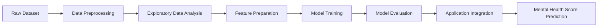

<div align="center">

# 🧠 Mental Health Score Predictor 

### A Machine Learning application that predicts mental health scores from lifestyle and behavioral data

<p>
  
  
  
  
</p>
<p>
  
  
  
  
</p>
<p>
  
  
  
  
</p>

</div>

---

## 📌 Overview

The **Mental Health Score Predictor** is a machine learning application built in Python that estimates a person's **mental health score** from lifestyle and behavioral input features, such as social media usage and daily habits.

The project covers the complete workflow: data preprocessing, exploratory data analysis (EDA), feature preparation, model training and evaluation, and integration of the trained model into an application that generates predictions from user-provided inputs.

---

## ✨ Features

- 📊 **Exploratory Data Analysis** to understand patterns between lifestyle factors and mental health
- 🧹 **Data preprocessing** including cleaning, encoding and feature preparation
- 🤖 **Predictive modeling** using Scikit-learn
- 📈 **Model evaluation** to measure performance on unseen data
- 🖥️ **Interactive application** that takes user inputs and returns a predicted score

---

## 🛠️ Tech Stack

| Category | Tools |
|----------|-------|
| **Language** | Python |
| **Data Handling** | Pandas, NumPy |
| **Machine Learning** | Scikit-learn |
| **Frontend** | HTML, CSS, JavaScript |
| **Environment** | Jupyter Notebook, VS Code |

---

## 📁 Project Structure

```
mental_health_recorder/
│
├── README.md                          # Project documentation
├── Student Social Media And Mental... # Dataset used for training
├── mental health.ipynb                # Data analysis, preprocessing & model training
├── main.py                            # Application / prediction logic
├── index.html                         # User interface
├── style.css                          # Styling
└── script.js                          # Frontend logic
```

---

## 🔄 Workflow



1. **Data Preprocessing:** cleaned the dataset, handled missing values and encoded categorical features.
2. **EDA:** analyzed distributions and relationships between features and the target score.
3. **Feature Preparation:** selected and prepared input features for modeling.
4. **Model Training:** trained predictive models using Scikit-learn.
5. **Evaluation:** assessed model performance using suitable metrics.
6. **Integration:** connected the trained model to an application that predicts scores from user inputs.

---

## 🚀 Getting Started

### Prerequisites

- Python 3.8 or higher
- pip

### Installation

```bash
# 1. Clone the repository
git clone https://github.com/ruchitasingla/mental_health_recorder.git

# 2. Move into the project folder
cd mental_health_recorder

# 3. Install the required libraries
pip install pandas numpy scikit-learn
```

### Run the Application

```bash
python main.py
```

Then open `index.html` in your browser (or the local URL shown in the terminal) and enter your details to get a prediction.

### Explore the Analysis

```bash
jupyter notebook "mental health.ipynb"
```

---

## 📊 Results

> Add your model's performance here, for example:

| Metric | Score |
|--------|-------|
| R² Score | _your value_ |
| MAE | _your value_ |
| RMSE | _your value_ |

---

## 🔮 Future Improvements

- Experiment with more advanced models and hyperparameter tuning
- Add data visualizations for feature importance
- Expand the dataset for better generalization

---

## ⚠️ Disclaimer

This project is built for **educational purposes only**. The predictions are not a medical diagnosis. If you are struggling with your mental health, please reach out to a qualified professional.

---

## 👩‍💻 Author

**Ruchita Singla**

<a href="https://www.linkedin.com/in/ruchita-singla/">
  
</a>
<a href="https://github.com/ruchitasingla">
  
</a>
<a href="mailto:ruchitasingla001@gmail.com">
  
</a>

---

<div align="center">

⭐ If you found this project helpful, consider giving it a star!

</div>
